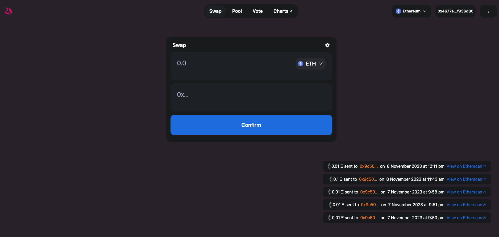
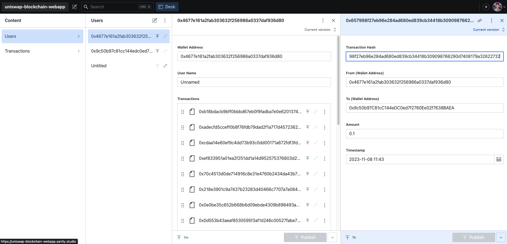
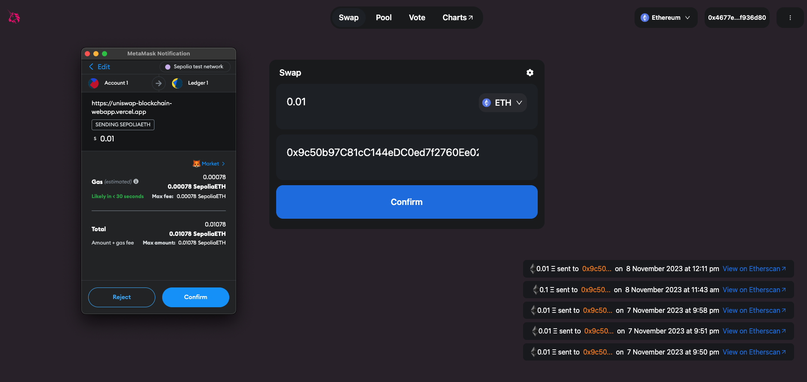
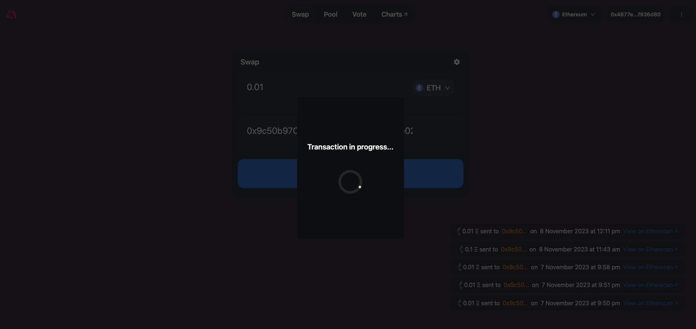
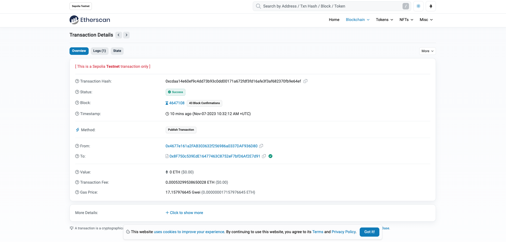

# UNISWAP Blockchain Web App Clone

## Client built with Next.js & Typescript

### Deployed with Vercel

https://uniswap-blockchain-webapp.vercel.app/

 

## Smart Contract built with Solidity 

### Ethereum Sepolia Testnet tokens retrieved from:

https://sepoliafaucet.com/

 

## Database created with Sanity 

### Deployed with Sanity

https://uniswap-blockchain-webapp.sanity.studio/

 

### *To use this app please aquire free Ethereum (Sepolia) Testnest tokens from the link above!*

 

## Screenshot of deployed app with Vercel:

 

## Screenshot of deployed database with Sanity:

 

## Screenshot of Metamask mid-transaction:

 

## Screenshot of Modal indicating transaction in process:

 

## Screenshot of transaction appearing on Etherscan:

